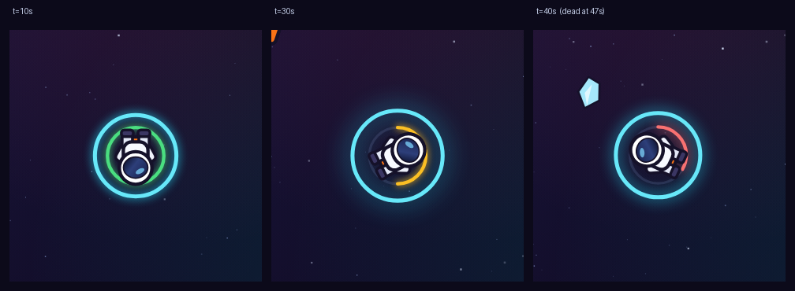

# Process overview

## What I built

**SPACEWALK** — an astronaut with jet boots drifts home through a debris field.
The pointer steers, a tap spends a booster. Since the spec forbids instructions,
the tap that starts a run is the same tap that spends the booster: starting *is*
the lesson.

## The moments that mattered

Both came from playing the finished thing, not from reading it.

**1. Debris that couldn't kill you.** I was hit constantly across a full run and
never died, so runs never resolved — and a game that can't be lost fails the
spec. The obvious fix was instant death on a dead-on hit. Instead a hit drains a
six-point pool: three for a dead-on, one for a clip, both still spinning you
out. It draws as a ring inside the booster ring, so a hit's cost is visible as
it lands, with no word to explain it. Then the fix broke the other half — a
careful player now died around 90s of 120s and never saw the rocket. Rather than
tune by feel I played the real simulation across 40 seeds with a look-ahead
policy, moved two spawn intervals until it got home 24 times in 40 (worst run
still dead at 64s), and made that probe a test demanding *both* endings.
[`57a1a37`](https://github.com/comp4020-agentic-coding-studio/comp4020-crit5-evealitaylor/commit/57a1a37),
[`71b262b`](https://github.com/comp4020-agentic-coding-studio/comp4020-crit5-evealitaylor/commit/71b262b)

**2. A destination that read as scenery.** The ship sat in the background for
most of the run, which made the goal confusing rather than clear. Making it
bigger or brighter would only have made the wrong thing louder, so I removed it
from the run entirely: it now arrives with the final stretch as the field thins.
Screenshotting the ending caught a fault the change exposed: the wordmark faded
back in directly across the docked ship.
[`71b262b`](https://github.com/comp4020-agentic-coding-studio/comp4020-crit5-evealitaylor/commit/71b262b)
